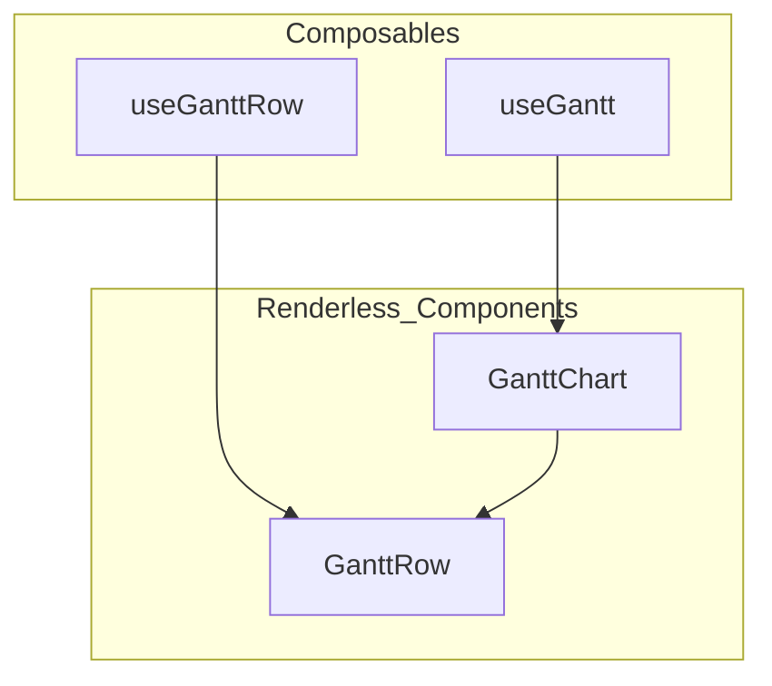

# Phase 2: API & Architecture Design

In this phase the project defines the core composables and renderless components. Highlights from `COMPOSABLE_GANTT.md`:

- Draft composables such as `useGantt` alongside `<GanttChart>` and `<GanttRow>` primitives.
- Specify props and slots for start and end dates, precision, and event callbacks.
- Outline headless primitives for time-scale generation, bar management, pointer events, and keyboard interactions.
- Plan TypeScript definitions and JSDoc comments for full IDE support.

See the [API design notes](../composable-gantt/COMPOSABLE_GANTT.md#L22-L30) for the source of these requirements. Additional context around composable patterns appears on
[lines 198–211](../composable-gantt/COMPOSABLE_GANTT.md#L198-L211) and the
[three-layer architecture sketch](../composable-gantt/COMPOSABLE_GANTT.md#L346-L354).

## Task
- Produce a more detailed design document using `COMPOSABLE_GANTT.md` as the primary reference, expanding on component APIs and architectural diagrams.

## Interface Sketches

```ts
export interface UseGanttOptions {
  startDate: Date
  endDate: Date
  precision?: 'hour' | 'day'
}

export interface UseGanttReturn {
  timeScale: Ref<TimeScale>
  rows: Ref<GanttRowModel[]>
  bars: Ref<GanttBarModel[]>
  moveBar: (id: string, delta: number) => void
  zoom: (factor: number) => void
}

export function useGantt(options: UseGanttOptions): UseGanttReturn

export interface GanttChartProps {
  start: Date
  end: Date
  precision?: 'hour' | 'day'
}

export interface GanttRowProps {
  row: GanttRowModel
}

export interface UseGanttRowReturn {
  bars: Ref<GanttBarModel[]>
  addBar: (bar: GanttBarModel) => void
}
```

These signatures align with the draft found in
[lines 488–501](../composable-gantt/COMPOSABLE_GANTT.md#L488-L501) and
follow VueUse patterns for composables.

## Architecture Overview



The diagram visualizes the renderless component strategy described in
[lines 346–354](../composable-gantt/COMPOSABLE_GANTT.md#L346-L354).

Back to [index](index.md)
